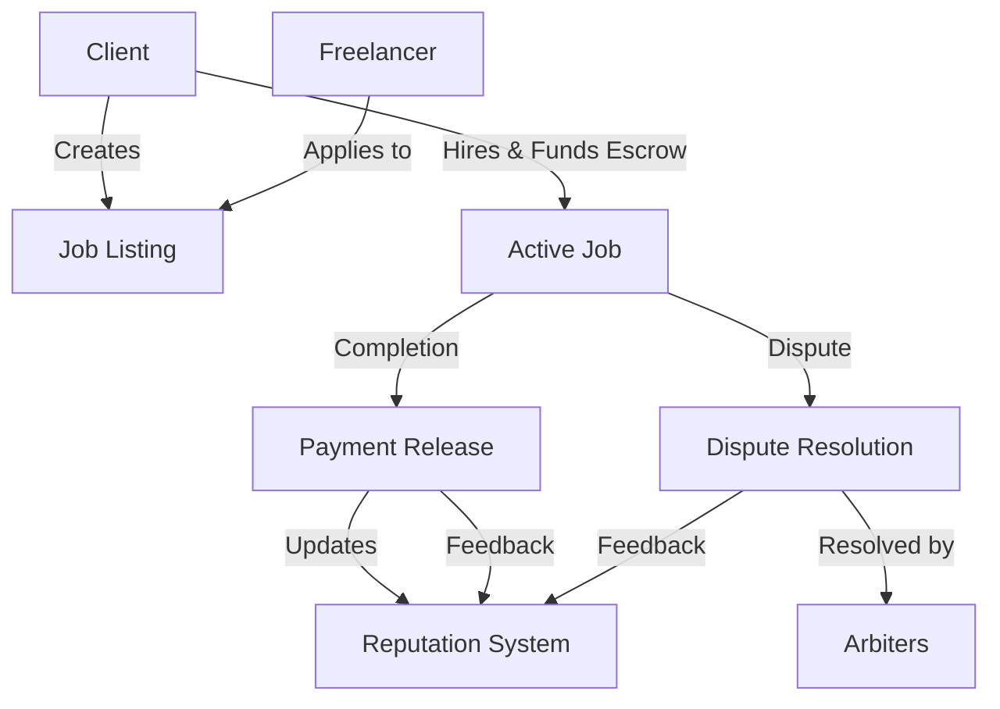

# FlexHive Gig Marketplace

A decentralized marketplace built on Stacks connecting freelancers with clients seeking flexible work arrangements. FlexHive enables secure, transparent transactions while reducing intermediary fees through smart contract automation.

## Overview

FlexHive facilitates the entire lifecycle of freelance work through smart contracts:

- Job listing creation and management
- Freelancer applications and hiring
- Secure escrow-based payments
- Transparent dispute resolution
- Reputation tracking system
- Platform fee management

The platform creates a self-regulating ecosystem that rewards quality and reliability while protecting both clients and freelancers.

## Architecture



The system is built around several key components:

1. **Job Listings**: Clients create detailed job postings with requirements and budget
2. **Applications**: Freelancers submit proposals and bid amounts
3. **Escrow System**: Secure payment holding during job execution
4. **Dispute Resolution**: Arbiter-managed conflict resolution
5. **Reputation Tracking**: Maintains user credibility through successful completions and feedback

## Contract Documentation

### Key Features

#### Job Management
- Create job listings with detailed specifications
- Browse and apply to available jobs
- Hire freelancers and manage work status

#### Payment Processing
- Secure escrow system
- Automated fee calculation and distribution
- Protected payment release mechanism

#### Dispute Resolution
- Dedicated arbiter system
- Evidence submission and review
- Multiple resolution options (client favor, freelancer favor, split)

#### Reputation System
- Track completed jobs and earnings
- Rating and feedback mechanism
- Historical performance metrics

### Access Control

- `contract-owner`: Administrator rights for platform management
- `arbiters`: Authorized dispute resolvers
- Client-specific functions restricted to job creators
- Freelancer-specific functions restricted to hired workers

## Getting Started

### Prerequisites

- Clarinet
- Stacks wallet
- STX tokens for transactions

### Usage Examples

1. Creating a Job Listing:
```clarity
(contract-call? .flexhive-marketplace create-job-listing 
    "Web Developer Needed"
    "Build a responsive website..."
    "Web Development"
    (list "JavaScript" "React" "Node.js")
    u1000000 ;; 1000 STX
    u1672531200 ;; deadline timestamp
)
```

2. Applying for a Job:
```clarity
(contract-call? .flexhive-marketplace apply-to-job
    u1 ;; listing-id
    "I'm an experienced developer..."
    u950000 ;; bid amount
)
```

3. Hiring a Freelancer:
```clarity
(contract-call? .flexhive-marketplace hire-freelancer
    u1 ;; listing-id
    'SP2J6ZY48GV1EZ5V2V5RB9MP66SW86PYKKNRV9EJ7 ;; freelancer address
)
```

## Function Reference

### Public Functions

```clarity
(create-job-listing (title (string-ascii 100)) (description (string-utf8 1000)) (category (string-ascii 50)) (skills (list 10 (string-ascii 30))) (budget uint) (deadline uint))
(apply-to-job (listing-id uint) (proposal (string-utf8 500)) (bid-amount uint))
(hire-freelancer (listing-id uint) (freelancer principal))
(mark-job-completed (listing-id uint))
(release-payment (listing-id uint))
(create-dispute (listing-id uint) (evidence (string-utf8 1000)))
(leave-feedback (listing-id uint) (recipient principal) (rating uint) (comment (string-utf8 500)))
```

### Read-Only Functions

```clarity
(get-listing (listing-id uint))
(get-application (listing-id uint) (freelancer principal))
(get-reputation (user principal))
(get-platform-fee-bps)
```

## Development

### Testing

Run tests using Clarinet:
```bash
clarinet test
```

### Local Development

1. Start Clarinet console:
```bash
clarinet console
```

2. Deploy contract:
```bash
clarinet deploy
```

## Security Considerations

### Limitations

- Maximum job listing duration enforced
- Platform fees capped at 10%
- Dispute resolution requires authorized arbiters

### Best Practices

1. Always verify transaction status
2. Review job details thoroughly before hiring
3. Maintain evidence of work completion
4. Use dispute resolution for conflicts
5. Check user reputation before engaging